# Architecture

Kraft is one FastAPI process. It serves the SPA and the API, walks each work
item's chain, and spawns an agent CLI or a command for each task in the item's
git worktree. Its state is two SQLite databases under `$KRAFT_HOME/run/`:
`orchestrator.db`, the record of every work item, and `index.db`, a search
index that Kraft can rebuild at any time.

The full page, with the parts, how a work item moves from filing to merge, the
trust boundaries and what is kept on disk, lives on the docs site:
[Architecture](https://itsomidkarami.github.io/kraft/project/architecture).
Its source is
[`docsite/content/6.project/5.architecture.md`](docsite/content/6.project/5.architecture.md).

The map of every module in `src/kraft/` and the "where to change things" table
are on the
[Source map](https://itsomidkarami.github.io/kraft/project/source-map) page.
Its source is
[`docsite/content/6.project/6.source-map.md`](docsite/content/6.project/6.source-map.md).

Kraft plugins, the chains and components an instance installs from a
collection, are handled by `src/kraft/plugins/`. It fetches a collection into a
bare mirror, extracts each plugin into a content-addressed store under
`run/plugins/`, and hands the template library a read-only layer per plugin.
See
[Plugins and collections](https://itsomidkarami.github.io/kraft/reference/configuration/plugins).

For how one work item moves from filing to merge, and its seven statuses, see
[How a work item runs](https://itsomidkarami.github.io/kraft/concepts/how-a-work-item-runs).
For the vocabulary, see
[Concepts](https://itsomidkarami.github.io/kraft/concepts/vocabulary).

The diagrams are Mermaid sources in `docsite/diagrams/`, rendered to SVG with
`just docs-diagrams`.

## Closed sets

Work item status, session status, stop kind and display status are defined once in `src/kraft/vocab/`. Each has a `StrEnum`; the two statuses also have a traits table built with `total()`, and the groups other code reads (`ENDED`, `STOPPED`, `LIVE`, ...) are computed from it. The five review sets (review outcome, thread label, thread state, reply claim, diff side) are plain enums beside them, with no traits. The SQLite CHECK text, the stop-kind trigger and `frontend/src/types/vocab.generated.ts` (`just vocab`) are produced from the same definition.

To add a status, add the member and its row; each piece you miss fails a named guard:

| Missing piece | Guard that trips |
|---|---|
| a row in `TRAITS` / `SESSION_TRAITS` | importing `kraft.vocab` raises, naming the member |
| the table-rebuild migration | `tests/test_db.py` fails on the database migrated from v1 |
| the regenerated TS | `tests/test_vocab_generated.py` |
| a case in a TS table | `tsc -b` |
| a door-table state | `tests/vocab/test_work_item.py` (and each door's `takes` must agree with `admits_status`) |
| the exact-line old-schema fixtures | adding a member re-wraps the generated CHECK, so update the lines matched in `tests/test_db_migrations.py` in the same change |

Event types are defined the same way in `src/kraft/vocab/events/`: one `StrEnum` per family, and the families are the sections of the docs' events page. `EventType` is their union. A set of types more than one module reads (`RUN_BOUNDARY`, `GATE_CLOSED`, `RESTARTS_RUN`) is a trait in the family's table; a set one module reads stays in that module as a tuple of members. A stored type string never changes.

To add an event type, add the member to its family and then:

| Missing piece | Guard that trips |
|---|---|
| a row in the family's traits table | importing `kraft.vocab` raises, naming the member |
| a row in `docsite/content/5.reference/10.events.md` | `tests/vocab/test_events.py` |
| the regenerated TS | `tests/test_vocab_generated.py` |
| the regenerated `vscode/schemas/notify.schema.json` (`just schemas`; `notify.yaml`'s `events` lists the valid names) | `tests/test_config_schemas.py::test_the_committed_schema_is_current` and the `config-schemas-current` pre-commit hook |
| the family size and the total in `tests/vocab/test_events.py` | that test |

`events.append` refuses a type that is not a member, and a test walks `src/kraft` to check every `events.append` names a family member, so a writer cannot use a bare string.
