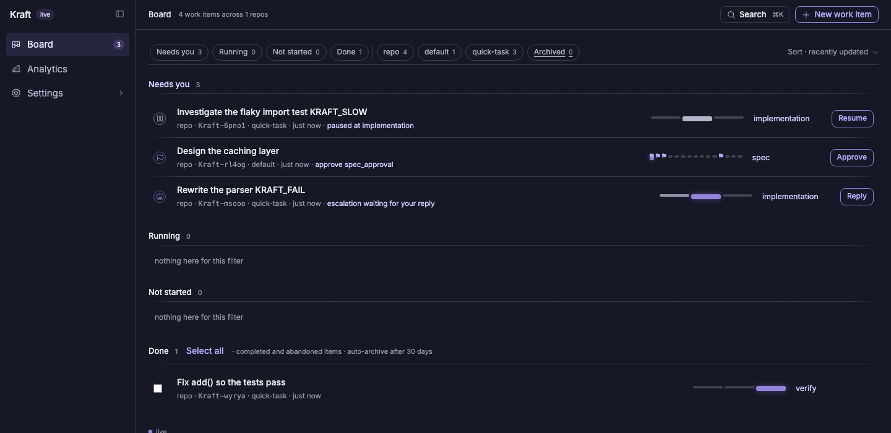
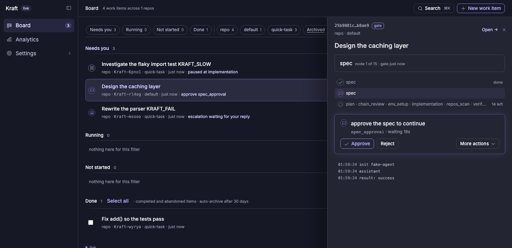
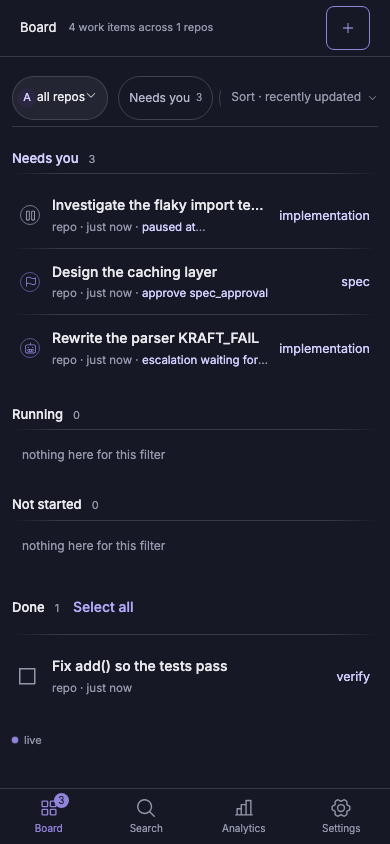
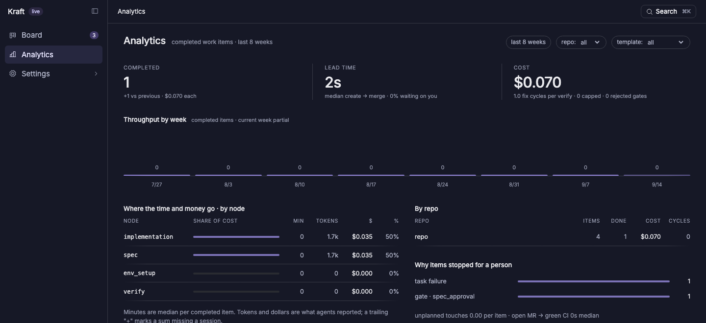
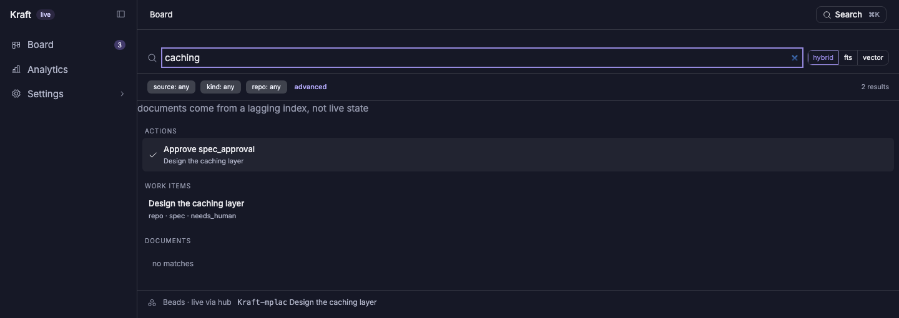

# Kraft

[](https://github.com/itsOmidKarami/kraft/actions/workflows/test.yml)
[](https://pypi.org/project/kraft-sdlc/)
[](https://github.com/itsOmidKarami/kraft/releases)
[](LICENSE)
[](https://itsomidkarami.github.io/kraft/)

A local orchestrator for semi-autonomous software work. One FastAPI process plus a
React SPA: work items enter as [**chains**](https://itsomidkarami.github.io/kraft/concepts/#chain)
— ordered nodes materialized from a YAML template — and each node runs hook-point
tasks through plugin adapters (a headless agent, a subprocess, a builtin). Every
retry loop is capped; hitting a cap escalates to you with the full trace. Gates
stop the chain where a human decision belongs.

Runs on your machine, binds loopback by default, and edits your repos through git
worktrees. How it fits together: [ARCHITECTURE.md](ARCHITECTURE.md).

**[Full documentation](https://itsomidkarami.github.io/kraft/)**, including a
[getting-started tutorial](https://itsomidkarami.github.io/kraft/getting-started/)
and a [configuration reference](https://itsomidkarami.github.io/kraft/configuration/),
lives on the docs site — this README stays a tour, not the whole map.



<table>
<tr>
<td width="65%">

**A gate stops the chain where a human decides.** Approve, reject with a note
that re-runs the producing node, or open the full detail view.



</td>
<td width="35%">

**Same board, phone-sized.** Approving from a tunnel doesn't need new code —
see [Remote access](#remote-access) below.



</td>
</tr>
</table>

## Install and run

```bash
uv tool install kraft-sdlc
kraft admin init   # register the MCP server and skills with your agent
kraft              # http://127.0.0.1:8765
```

No `uv`? The install script fetches the newest release and installs `uv` first
if you do not have it:

```bash
curl -fsSL https://raw.githubusercontent.com/itsOmidKarami/kraft/main/install.sh | sh
```

[`install.sh`](install.sh) is short and worth reading before you pipe it to a
shell. `kraft admin update` installs the newest release later on (`--restart`
also restarts a running server, the same way it was running), and
`kraft --version` says what you have.

### Homebrew (macOS)

```bash
brew tap itsOmidKarami/kraft
brew install kraft
kraft admin init
kraft
```

`kraft admin update` detects a Homebrew install and runs `brew upgrade kraft`
instead of its usual `uv tool install`, so either update path works.

### From source (development)

```bash
just setup      # uv sync + npm install
just install    # build the SPA, install the `kraft` command
kraft           # http://127.0.0.1:8765
```

Releasing, and the labels a pull request needs: [CONTRIBUTING.md](CONTRIBUTING.md).

State lives in `$KRAFT_HOME` (default `~/.kraft`):

| | |
|---|---|
| `~/.kraft/run/` | `orchestrator.db`, `index.db`, `logs/`, `results/`, `worktrees/` |
| `~/.kraft/templates/` | the YAML the Settings screens edit — `library.yaml`, `chains/`, `harnesses.yaml`, `policy.yaml`, `repos.yaml`, `access.yaml` |

`templates/` is seeded from the packaged defaults on first run and never overwritten
after, so an upgrade cannot clobber an edited policy. It is a plain directory of
files on purpose: the Settings screens are an editor for something you can diff,
revert, and `git init` yourself.

Binding off loopback requires a password — set one in Settings → Access while still
on `127.0.0.1`. The process refuses to start on a LAN address without one.

`KRAFT_HOME=~/kraft-other kraft` gives you a second, fully separate instance.

## Use it from an agent session

Kraft can also be driven from a coding-agent session over MCP, so work can be
filed, read, and unblocked without switching to the browser.

They publish as a Claude Code plugin marketplace, alongside Kraft Lite:

```
/plugin marketplace add itsOmidKarami/kraft
/plugin install kraft@kraft
```

That's the one-step path: the plugin manifest bundles `kraft admin mcp` as an
`mcpServers` entry, so it registers the MCP server *and* the skills —
`/kraft:onboard` to connect a repo, `/kraft:board` to see what's running or
blocked, `/kraft:prepare` to spec and plan work, `/kraft:handoff` to file it,
`/kraft:status` to see where it got to, `/kraft:gates` to approve, reject, or
steer, `/kraft:check` to see if the repo's Kraft config has drifted — in the
same step, as long as `kraft` is already on `PATH`. It's managed too:
`/plugin update kraft`, `/plugin uninstall`. Kraft Lite's plugin doesn't
bundle an MCP server since it doesn't need `kraft` installed at all.

`kraft admin init` remains for the plain-file form, the repo-scoped
`.mcp.json` variant, or registering the MCP server for a host other than
Claude Code:

```bash
kraft admin init          # register the MCP server for your user, install the skills
kraft admin init --repo   # or write .mcp.json + .claude/skills/ into this repo
```

User scope shells out to `claude mcp add` rather than editing `~/.claude.json`
itself — that file is large, shared, agent-owned state, and is the closest
thing to a global install today, same as the plugin: every repo you open sees
Kraft's tools, not just the one you ran it from. If `claude` is not on
`PATH`, `kraft admin init` prints the command for you to run instead of
guessing. It writes the skill files under `.claude/skills/kraft/` directly,
with nothing registered in Claude Code's managed state — uninstalling is
`rm -rf`. Both forms produce the same namespaced commands. See
[docsite/content/2.reference/6.agent-integration.md](docsite/content/2.reference/6.agent-integration.md) for the full
breakdown, including Kraft Lite's `/kraft-lite:*` commands.

The tools you'll reach for most, over the same local HTTP API the browser uses:

| | |
|---|---|
| read | `list_work_items`, `get_work_item`, `search` |
| write | `create_work_item`, `ensure_repo` |
| act | `approve_gate`, `reject_gate`, `pause_work_item`, `resume_work_item`, `retry_work_item` |

Two rules are enforced in code, not in prose:

**An agent cannot start work.** Everything an agent creates lands paused, and the
board shows it as *Waiting to start* with a single Start button. Nothing spends
tokens until a person clicks it.

**A worker cannot act on itself.** Sessions Kraft starts carry
`KRAFT_WORK_ITEM_ID`, and any attempt to approve, reject, pause, or resume the
work item running that session is refused before a request is sent. A gate is
where a human decides; an agent approving its own would make the gate decorative.

`kraft admin mcp` runs the server on stdio, and every tool is also a `kraft` subcommand,
so hooks and non-MCP agents get the same surface.

## Remote access

Kraft's gate needs a browser to approve or reject. Approving from a phone or
a machine that isn't the one running the server doesn't need new code —
Kraft already has password auth (`access.yaml`) and a Host allowlist for a
non-loopback bind (`allowed_hosts`). Point a tunnel at it:

1. Set a password if you haven't: `kraft admin start` refuses a non-loopback
   bind without one.
2. Add the tunnel's hostname to `allowed_hosts` in `access.yaml` (Settings →
   Access, or hand-edit — see `kraft admin doctor` to confirm it parses).
3. `kraft admin start --host 0.0.0.0`.
4. Point a tunnel at the bound port:
   - **Tailscale**: `tailscale serve https / http://localhost:8765`, then
     open the board at your tailnet's HTTPS address from any device on it.
   - **Cloudflare Quick Tunnel**: `cloudflared tunnel --url http://localhost:8765`
     prints a `*.trycloudflare.com` URL — add that hostname to
     `allowed_hosts` before using it.

Signed one-shot approve/reject links and a Slack action endpoint were
considered and dropped: this gives phone access to the real board, with the
same auth, for no new code to secure.

## Inbound triggers

Kraft-859: start a chain from an event instead of typing into `kraft item
create` every time. Two doors, same effect — both always file the item
`paused`, exactly like manual intake: an agent cannot start work from a
trigger any more than from a human's own `kraft item create`.

**A cron schedule**, via a `triggers:` entry in `policy.yaml`:

```yaml
triggers:
  - cron: "0 9 * * 1,2,3,4,5"  # 5-field cron, minute resolution; 9am weekdays
    repo: /path/to/repo
    chain: default              # a chain_template id from templates/
    title: "Nightly dependency check"
    description: "Filed by the 9am weekday trigger"  # optional, defaults to ""
```

Checked once a minute against the current time; a missed minute (server
down, clock skew) is not backfilled — the spec (Kraft-7izl) treats that as
acceptable rather than an incident.

**An HTTP call**, via `POST /triggers` — the HTTP twin of the same cron entry,
for anything that can fire a webhook (CI, an external scheduler, a script
watching a queue) but can't wait for the next minute-tick:

```
POST /api/triggers
{"title": "...", "repo": "/path/to/repo", "chain_template": "default", "description": "..."}
```

It needs the same auth as every other mutating route — the session cookie a
browser holds after logging in, or an MCP bearer token — nothing
trigger-specific. See "Remote access" above for reaching this from off-machine.

## Without the orchestrator

`plugins/kraft-lite/` runs a chain inside a single agent session — gates, fix
loops and caps, no service. It is the attended half of Kraft: one chain, in front
of you, resumable across sessions but not outliving your terminal. Its chain,
`plugins/kraft-lite/chains/default.json`, is its own: it keeps the pre-V1 node
shape Kraft's templates had when it was last rendered from them, and Kraft's
Template Schema V1 does not feed it.

That directory is published as a standalone repo, so it
must stay self-contained: no import above `plugins/kraft-lite/`, no dependency
beyond the standard library.

See [`plugins/kraft-lite/README.md`](plugins/kraft-lite/README.md).

## Analytics

Lead time, cost, and where both go — by node, by repo, over whatever window
you pick. Built from the same events the board renders live, not a separate
pipeline.



## The `kraft` command

`kraft` with no arguments serves. Subcommands talk to a running server. Full
reference: [docs → CLI reference](https://itsomidkarami.github.io/kraft/cli/).

```bash
kraft view list                      # the board, scoped to the repo you are in
kraft view list --all --status=paused
kraft view show                      # the work item whose worktree you are in
kraft item create "fix the flaky test" --description "..."   # files it paused; a human starts it
kraft item create "ship the thing" --spec .engineering/specs/x.md   # skips the spec node
kraft item approve                   # approve whichever gate is pending
kraft item reject --note "the plan skips migrations"
kraft item pause / kraft item resume --steer "try the other adapter"
kraft item retry                     # re-run the node a stopped item stopped on
kraft view search "retry policy"
```

The same search — hybrid FTS + vector, jumping straight to a pending action,
a work item, or a document — is one keystroke away in the UI (⌘K):



Every verb takes `--json`, which prints the raw API payload — the same value
`kraft admin mcp` hands an agent. An id is optional wherever the work item can be
inferred from the directory you are standing in.

Following a running item:

```bash
kraft view logs -f            # the current session's log, until it stops
kraft view logs --session <id> -n 0
kraft view events             # node transitions, gate decisions, escalations
kraft view watch              # a live board, redrawn on every event
```

`kraft view logs --json` emits NDJSON — one object per line — because a stream has no
end to close an array on.

A log over 2 MB is read from its end: every structured reader (`kraft view logs`,
the log modal, `format=jsonl`) leads with one `sys` row, `n` -1, carrying
`"truncated": {"lines": …, "bytes": …}` for what it skipped. The plain-text log
(`GET /api/worker-sessions/<id>/log`) is always the whole file.

Reviewing before you approve:

```bash
kraft view diff --stat        # how big is it
kraft view diff --name-only   # changed and untracked paths
kraft view diff               # the coloured body, through $PAGER
kraft view docs               # specs, plans and summaries linked to the item
kraft view doc <id> --open    # open one in an editor on the server's machine
```

A truncated diff always says so on its last line, and files the agent wrote
without `git add` are listed separately — they are invisible in a unified diff.

Repos and worktrees:

```bash
kraft repo list              # what is connected; `*` marks the one you are in
kraft repo connect            # connect the current repo (safe to repeat)
kraft repo disconnect         # forget it again; work items are untouched
cd "$(kraft repo path <id>)"  # into the item's worktree; `kraft repo cd` is an alias
kraft repo path --shell       # a shell function that does the cd for you
kraft repo open <id>          # the worktree in an editor
```

A connected repo's entry in `repos.yaml` carries how Kraft prepares a worktree
for it:

| Key | What it does |
|---|---|
| `setup_command` | Run in every new worktree before any node starts. Required — `""` means "deliberately nothing". A repo with no `setup_command` stops its next work item. |
| `env` | Literal variables every worker for this repo gets. |
| `env_passthrough` | Names of variables to carry over from the daemon's own environment, for what the baseline allowlist does not cover. |

`kraft repo connect` probes a `setup_command` from the repo's markers; check it
before trusting it, and `kraft admin doctor` reports any repo still undeclared.
Full field list: [docs → Configuration](https://itsomidkarami.github.io/kraft/configuration/#reposyaml-connected-repos).

Editing a repo's settings stays in the UI.

Service and admin:

```bash
kraft admin start --port 9000  # the same as bare `kraft`; flag > env > access.yaml
kraft admin stop               # SIGTERM to the pid in run/kraft.pid
kraft admin restart            # stop, then start again the same way it was running
kraft admin health             # exit 1 when degraded, reasons on stdout
kraft admin doctor             # every check in one pass; exit 1 if any fails
kraft admin reindex [--repo P] # rescan documents into the search index
```

A non-loopback bind still refuses to start without a password, flag or not.
The server runs in the foreground, so Ctrl-C stops the one in front of you;
`kraft admin stop` is for the one you started somewhere else. A second start
against the same run directory is refused while the first is alive.

The verbs live in four groups — `item` acts, `view` reads, `repo` is
repositories and their worktrees, `admin` is this machine's server. Typing an
old flat verb prints where it moved.

### Shell completion

`kraft` ships tab completion for zsh (and any other shell `argcomplete`
supports) via [`argcomplete`](https://github.com/kislyuk/argcomplete). Add
one line to `~/.zshrc`:

```zsh
eval "$(register-python-argcomplete kraft)"
```

then `kraft it<TAB>` completes to `kraft item`, `kraft item <TAB>` lists
`create approve reject pause resume retry abandon`, and so on down the verb
tree. Takes effect after your next `kraft` install or `uv sync`.

## Develop

```bash
just dev        # backend + vite, state in .dev/, agents faked — UI on :5173
just dev-seed   # fill a running dev instance with work items in every state
just dev-reset  # throw .dev/ away
```

`just dev` puts `fixtures/bin` on `PATH` ahead of the real agent, where `claude` is a
symlink to [`fixtures/fake-claude.sh`](fixtures/fake-claude.sh) — the same fake the
test suite uses, so it cannot rot. A dev instance never spends tokens and never
touches `~/.kraft`.

`dev-seed` drives the real HTTP API rather than writing rows, so the data is whatever
the executor actually produces. It lands four work items in four states: completed, a
pending gate, failed, and paused mid-flight. A title containing `KRAFT_FAIL` or
`KRAFT_SLOW` steers that item's fake agent without affecting the others.

```bash
just test       # backend tests (args pass through: just test -k search)
just test-ui    # frontend unit tests
just e2e        # Playwright (see frontend/e2e/README.md)
just lint       # ruff check + format check
just fix        # autofix
```

Everything is `just` — run `just` for the full list.

## Layout

```
src/kraft/        orchestrator: api, executor, policy, store, adapters/, index/
frontend/         React SPA (vite)
templates/        the V1 library, chains, harness profiles and policy — the install seed
dev/seed.py       dev-instance seeder
fixtures/         fake agent + the PATH shim just dev uses
docs/intent/      intended behaviour as pinned requirements, each tied to a test
```

## Requirements

Python 3.14+, [uv](https://docs.astral.sh/uv/), Node 20+, git, and `claude` for
real runs (not needed for `just dev`).
[`bd`](https://github.com/gastownhall/beads) is optional: with it, every work
item gets a tracked bead, and without it Kraft files work anyway and says so.
Semantic search is opt-in:
`just setup-vector` (downloads a ~130MB model on first search); without it `/search`
still works in FTS mode.
