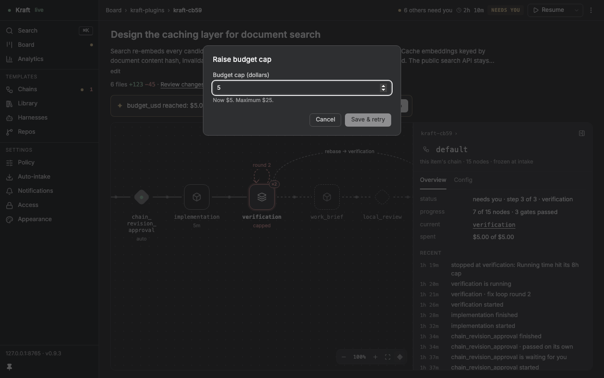
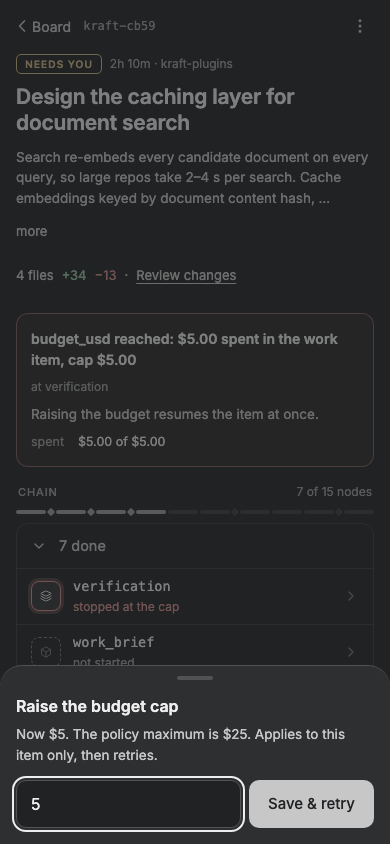

# kraft/ux2-fix-raise-policy-budget

Kraft-9d8b2.59: a budget stop whose governing cap is a policy `budget_usd` names it in `stop.limit`, and /ng raises it by patching the policy and retrying (not `/budget/raise`, which refuses that stop).

Cells (`cases/ux2-fix-raise-policy-budget.ts`): `ng-item-budget-policy/banner` (1280 dark and light), `editor` (768 and 1280, dark and light: the Raise budget cap dialog, "Now $5. Maximum $25."); `ng-phone-item-budget-policy/sheet` (390: the dollar sheet the phone's Raise budget now opens). Flow `phone-raise-policy-budget` (`.flows.ts`): Raise budget opens the dollar sheet and no +$5 choice, a figure above the maximum is refused in place, a figure PATCHes the policy then POSTs retry and never calls /budget/raise. The cells set the stop and `budget_cap` on the mock's `capped` bundle in the cell itself, so no existing cell's data changed.

Rules (`waves/ux2-fix-raise-policy-budget.json`): no offscreen, clipped-v or contrast flag and no console error on the two screens; the flow completes (its id is `flow-phone-raise-policy-budget`: the rule is checked to match it).

`node sweep/wave.mjs all`, baseline shot on origin/main (84981b588) in a clean worktree: no newly flagged cells; 11 changed, the new cells among them. Not covered by a cell: the board peek's footer and the Config budget editor on a policy stop (the same BudgetEditor, unit-tested; run by hand against a real server too).

 
