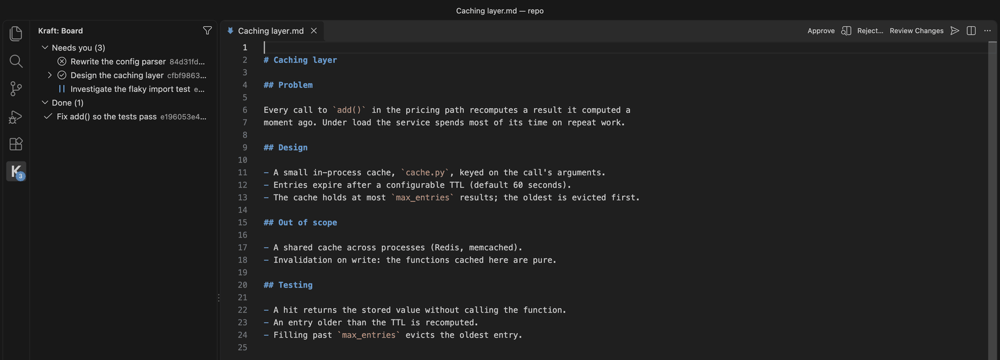
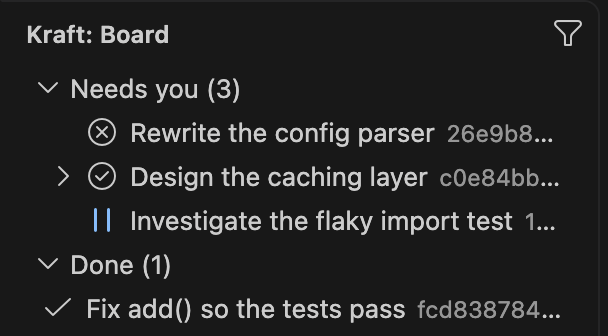
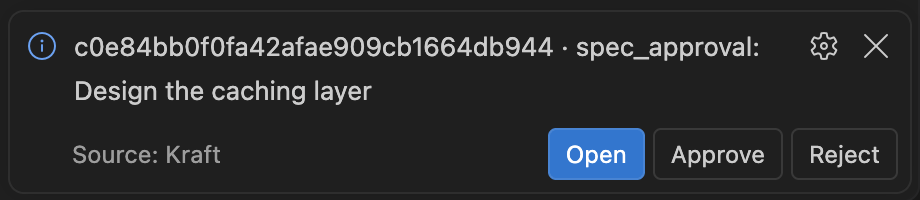
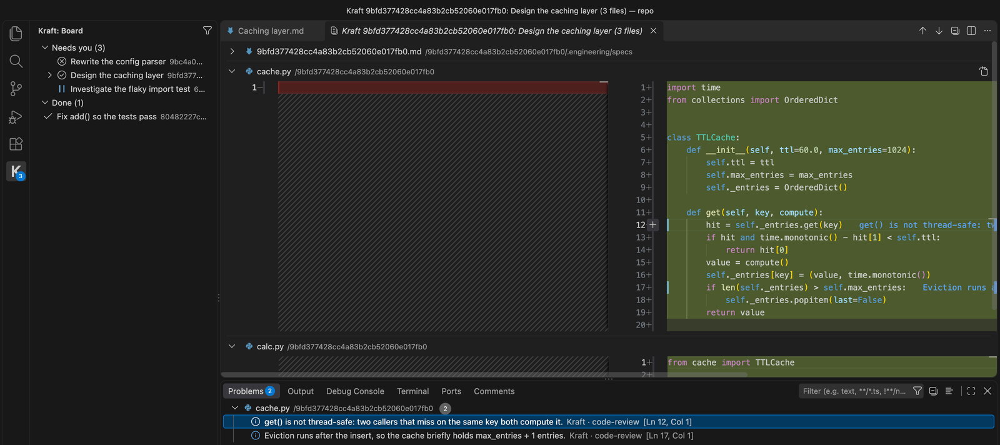
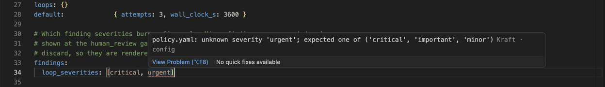

# Kraft for VS Code

**A local orchestrator that takes your coding agent from spec to pull request,
stopping only when a decision is yours.**

Kraft isn't another coding agent. It runs the one you already use (Claude Code,
Codex and others), and adds what a single session can't: a process the agent
can't skip, checks it doesn't grade itself on, and a person at the decisions
that matter.

This extension brings those decisions into the editor. See what every work item
is doing, approve or reject a gate, review a branch's diff with the review
agents' findings on the lines they name, and edit Kraft's config with errors
flagged as you type.



## Get started

1. Install Kraft:

   ```bash
   uv tool install kraft-sdlc
   ```

   or with Homebrew: `brew tap itsOmidKarami/kraft && brew install kraft`.
   The [Install page](https://itsomidkarami.github.io/kraft/get-started/install)
   covers the other ways.
2. Start it: run `kraft`.
3. Open VS Code. The extension finds the running Kraft on its own: it reads
   `KRAFT_HOST` and `KRAFT_PORT`, then `bind` and `port` from
   `$KRAFT_HOME/templates/access.yaml`, and falls back to `127.0.0.1:8765`. Set
   `kraft.url` only when Kraft listens somewhere else.

If Kraft isn't running, the board shows **Kraft isn't running — Start**, which
runs `kraft admin start` in a terminal.

## Board



The Kraft view in the activity bar lists every work item, grouped as in the web
UI, with a badge counting the ones waiting on you. It shows the repos open in
the window; the filter button shows every repo. Right-click an item to pause,
resume, retry, skip, escalate, cancel or archive it, open its worktree in a new
window, or open it in the web UI.

## Gates



When a gate opens, a notification offers **Open**, **Approve** and **Reject**.
Open shows the gate's document in a tab, with Approve and Reject in its title
bar. A reject asks for a reason, which goes to the agent.

## Review



Run **Review Changes** from an item's menu on the board, or from a gate
document's title bar, to open its branch in the multi-file diff editor. Findings from the review agents show on the lines they
name, as a colored bar with the message beside the line, and in the Problems panel. Comment on any line, then run
**Submit Review**: your comments reach the agent as one note, as a reject at a
gate or as a steer on a paused item. Approving instead asks before it discards
your comments.

## Config



Kraft's config files under `$KRAFT_HOME/templates` (`policy.yaml`,
`harnesses.yaml`, `chains/*.yaml` and the rest) are checked by the running
Kraft as you edit, with the line at fault flagged. With
[Red Hat YAML](https://marketplace.visualstudio.com/items?itemName=redhat.vscode-yaml)
installed they also get completion from Kraft's JSON Schemas. On a chain file,
**Show Resolved Chain** previews the chain after inheritance. On save, the
extension offers to reload Kraft, or to restart it for files Kraft reads only at
startup.

## Requirements

- Kraft running on the same machine (`kraft`, or `kraft admin start`). The
  extension and Kraft must be on the same release line: if Kraft's version does
  not match, the extension turns read-only, and the board still updates while
  every action is disabled.
- [Red Hat YAML](https://marketplace.visualstudio.com/items?itemName=redhat.vscode-yaml)
  for completion in config files. The extension offers it once if it is missing.

## Settings

- `kraft.url`: where Kraft listens. Empty reads `KRAFT_HOST` and `KRAFT_PORT`,
  then `bind` and `port` from `$KRAFT_HOME/templates/access.yaml`.
- `kraft.notifications`: `all`, `gates` or `off`, which states raise a
  notification. `gates` announces only gates; `all` also announces an item that
  stopped and needs you.

## Learn more

- [Kraft for VS Code](https://itsomidkarami.github.io/kraft/guides/vscode), the guide to this extension
- [Why Kraft](https://itsomidkarami.github.io/kraft/get-started/why-kraft): what it does that a session, a loop or a skill does not
- [Documentation](https://itsomidkarami.github.io/kraft/)
- [GitHub](https://github.com/itsOmidKarami/kraft): source, releases and issues
